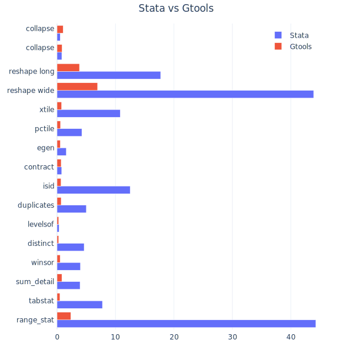

# Build Stata Gtools with Intel C Compiler on Windows

`stata-gtools-wintel` provides a native compilation of [Stata-Gtools](https://github.com/mcaceresb/stata-gtools) on Windows with Intel C compiler.

## Build

```powershell
git clone 
cd stata-gtools-wintel
git submodule update --init -recursive

# patch
patch ./stata-gtools/src/plugin/gtools.h < ./patches/gtools_h_wintel.patch
patch ./stata-gtools/src/plugin/common/fixes.c < ./patches/fixes_c_wintel.patch
patch ./stata-gtools/src/plugin/common/quicksort.c < ./patches/quicksort_c_wintel.patch
patch ./stata-gtools/src/plugin/common/quicksortMultiLevel.c < ./patches/quicksortMultiLevel_c_wintel.patch

# compile
cmake `
-DCMAKE_BUILD_TYPE=RELEASE `
-DUSE_OPENMP=OFF `  # on if need parallel support
-DCMAKE_C_COMPILER=icx `
-DCMAKE_CXX_COMPILER=icx `
-G "NMake Makefiles" ..

nmake
```

## Benchmark

```bash
Program:   StataNow/MP 18.5 with 16-core License
OS:        x86_64 Windows
Processor: Intel(R) Core(TM) i7-10700F CPU @ 2.90GHz
Memory:    32GiB
```

<picture>
  <source media="(prefers-color-scheme: dark)" srcset="test/bench_dark.svg">
  <source media="(prefers-color-scheme: light)" srcset="test/bench_light.svg">
  
</picture>
